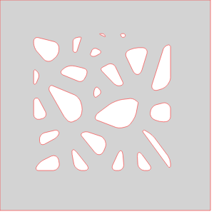
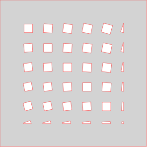
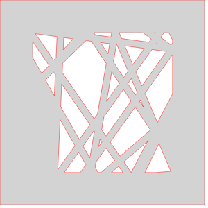
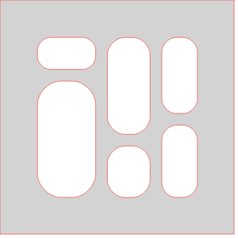
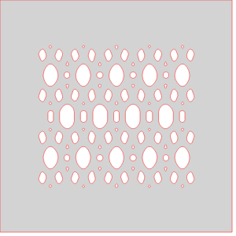
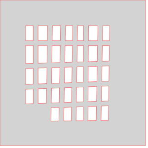

# Outer Designs
## StraightCollarOuter

## ConicCuffOuter

## StraightCuffOuter

# Inner Designs
## InnerDesignVoronoi

## InnerDesignHashmarks

## InnerDesignLattice

## InnerDesignVera

## InnerDesignCirclesXVera

## InnerDesignCirclePacking

## InnerDesignHexes

## InnerDesignLines

## InnerDesignMondrian

## InnerDesignExplode

## InnerDesignEmpty

## InnerDesignSunflower

## InnerDesignTessagon

## InnerDesignPerlinDots

## InnerDesignGrid

