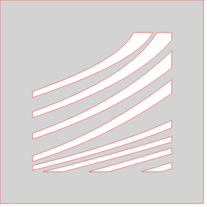
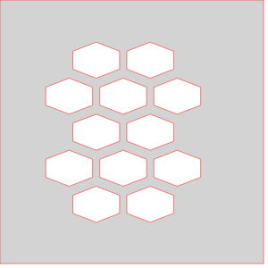
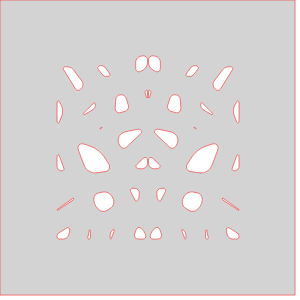
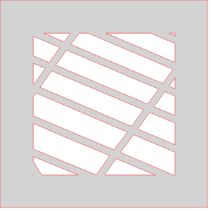
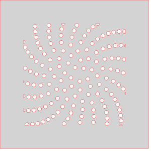
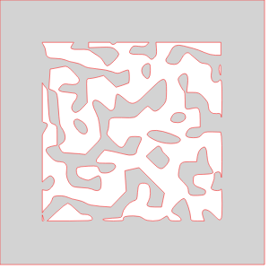
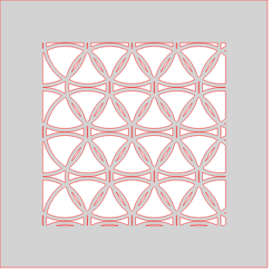
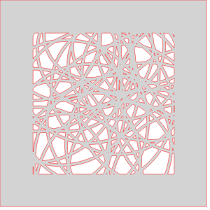
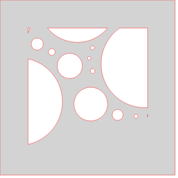
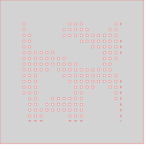

# Outer Designs
## StraightCollarOuter

## StraightCuffOuter

## BoxOuter

# Inner Designs
## InnerDesignMaze1

## InnerDesignVoronoi

## InnerDesignTessagon

## InnerDesignHashmarks

## InnerDesignVera

## InnerDesignHexes

## InnerDesignSnowflake

## InnerDesignMap

## InnerDesignSunflower

## InnerDesignGrid

## InnerDesignPerlinBlobs

## InnerDesignLattice

## InnerDesignCirclesXVera

## InnerDesignCirclePacking

## InnerDesignLines

## InnerDesignMondrian

## InnerDesignPerlinDots

## InnerDesignEmpty

